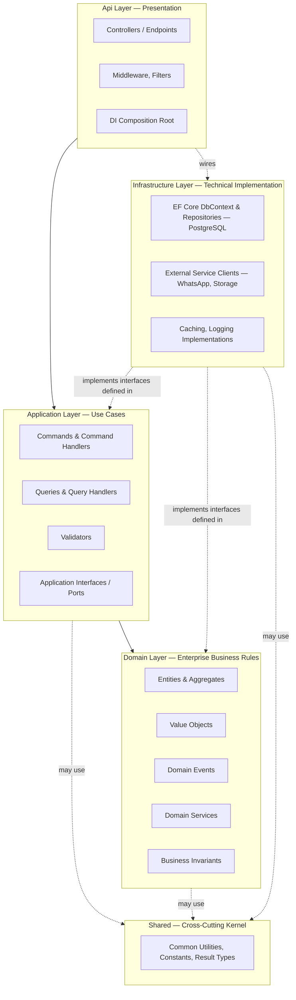
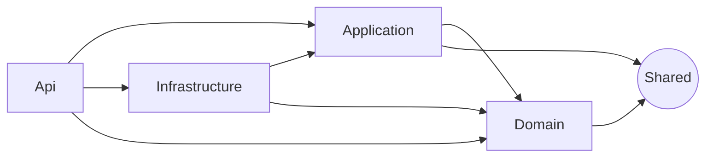
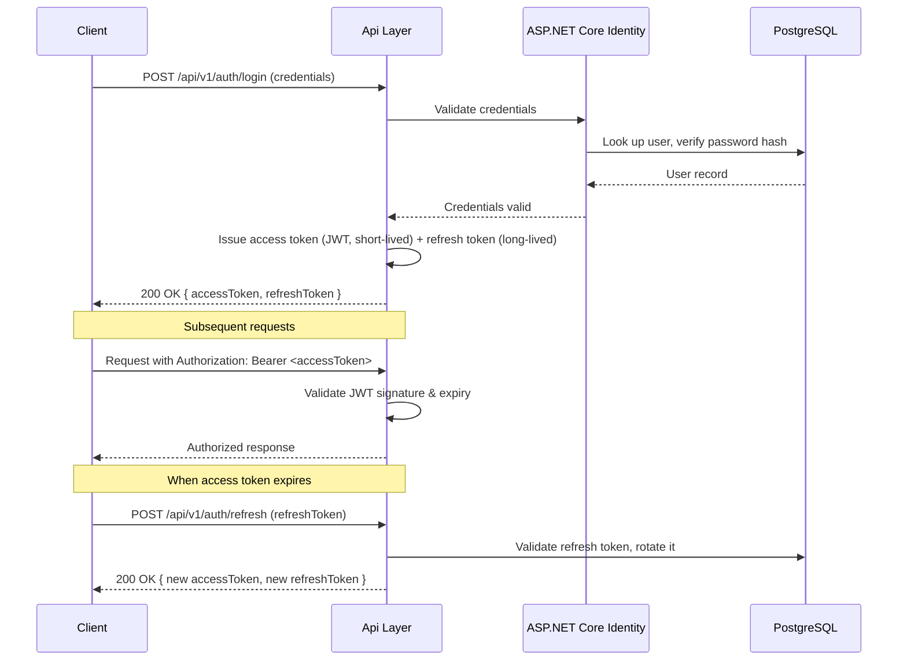
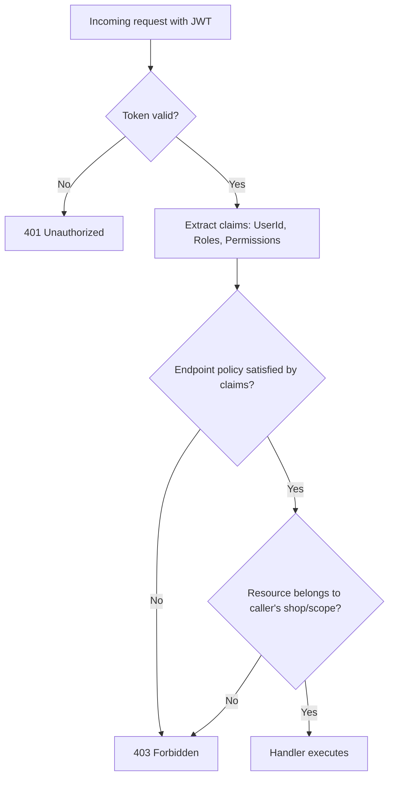

# 01 — Architecture

**Mathilens Tailoring ERP**
**Document Status:** Authoritative — governed by [00_MASTER_SPEC.md](./00_MASTER_SPEC.md)
**Version:** 2.1.0
**Last Updated:** 2026-08-04

---

## Table of Contents

1. [Executive Summary](#1-executive-summary)
2. [Architecture Goals](#2-architecture-goals)
3. [Architecture Decisions](#3-architecture-decisions)
4. [Architecture Constraints](#4-architecture-constraints)
5. [Clean Architecture Diagram](#5-clean-architecture-diagram)
6. [Dependency Diagram](#6-dependency-diagram)
7. [Project Structure](#7-project-structure)
8. [Layer Responsibilities](#8-layer-responsibilities)
9. [Layer Communication Rules](#9-layer-communication-rules)
10. [Dependency Injection Strategy](#10-dependency-injection-strategy)
11. [Validation Strategy](#11-validation-strategy)
12. [Logging Strategy](#12-logging-strategy)
13. [Exception Strategy](#13-exception-strategy)
14. [Configuration Strategy](#14-configuration-strategy)
15. [Caching Strategy](#15-caching-strategy)
16. [Background Job Strategy](#16-background-job-strategy)
17. [Authentication Flow](#17-authentication-flow)
18. [Authorization Flow](#18-authorization-flow)
19. [File Upload Strategy](#19-file-upload-strategy)
20. [Reporting Strategy](#20-reporting-strategy)
21. [Audit Strategy](#21-audit-strategy)
22. [Scalability Strategy](#22-scalability-strategy)
23. [Future SaaS Strategy](#23-future-saas-strategy)
24. [Future Multi-Tenant Strategy](#24-future-multi-tenant-strategy)
25. [Design Patterns Used](#25-design-patterns-used)
26. [Future Event-Driven Architecture](#26-future-event-driven-architecture)
27. [Future Microservice Migration Considerations](#27-future-microservice-migration-considerations)
28. [Risks](#28-risks)
29. [Tradeoffs](#29-tradeoffs)

---

## 1. Executive Summary

Mathilens Tailoring ERP is built on **Clean Architecture** with **CQRS** and the **Mediator pattern**, implemented in ASP.NET Core (backend) and Next.js (frontend). The architecture is chosen to satisfy a specific, non-negotiable requirement from [00_MASTER_SPEC.md](./00_MASTER_SPEC.md): this is a commercial product sold to multiple tailoring businesses, so the codebase must remain maintainable and extensible as modules ([00_MASTER_SPEC.md § 3](./00_MASTER_SPEC.md#3-erp-modules)) accumulate over years of active development, not just through an initial MVP push.

The architecture runs on **PostgreSQL from day one** — a production-grade relational database chosen up front specifically to avoid the operational risk and rework of a future database migration. Simplicity at this stage comes from the *application* architecture (a modular monolith, an in-process mediator, in-process domain events), not from deferring database quality. Every seam (repository interfaces, port abstractions, provider-independent data access) is in place so the product can grow into a multi-tenant SaaS platform on the same database engine it launches with. This document is the concrete realization of the principles stated in [00_MASTER_SPEC.md § 4 Engineering Principles](./00_MASTER_SPEC.md#4-engineering-principles).

## 2. Architecture Goals

| # | Goal | Why It Matters |
|---|------|-----------------|
| A1 | Strict separation of business logic from infrastructure | Business rules (how an order moves through its lifecycle, how billing is calculated) must be testable and understandable without a database or a web server running |
| A2 | Disciplined, provider-independent data access | Persistence code avoids unnecessary PostgreSQL-proprietary lock-in wherever practical, keeping `Domain`/`Application` fully decoupled from any specific database technology — see [02_DATABASE.md § 2.2 Provider Independence](./02_DATABASE.md#22-provider-independence-practical) |
| A3 | Modular growth | New modules ([00_MASTER_SPEC.md § 3](./00_MASTER_SPEC.md#3-erp-modules)) can be added without destabilizing existing ones (Open-Closed Principle) |
| A4 | Testability by construction | Every layer is testable in isolation because dependencies are inverted through interfaces, not concrete infrastructure |
| A5 | Operational simplicity at MVP scale | The MVP runs on minimal, production-grade infrastructure (a single containerized API, a single PostgreSQL instance) without over-engineering for a scale the product hasn't reached yet |
| A6 | A credible path to commercial SaaS scale | The architecture must not need to be thrown away when the product moves from single-shop deployments to a multi-tenant SaaS platform |

## 3. Architecture Decisions

| ID | Decision | Rationale | Status |
|----|----------|-----------|--------|
| AD-001 | Adopt Clean Architecture with four inner layers (`Domain`, `Application`, `Infrastructure`, `Api`) plus a `Shared` kernel | Enforces the dependency rule that keeps business logic independent of frameworks and infrastructure | Accepted |
| AD-002 | Adopt CQRS (logical, not physical) via an in-process mediator | Keeps read and write concerns cleanly separated without the operational cost of separate read/write databases at MVP scale | Accepted |
| AD-003 | Use **PostgreSQL as the sole database provider from Version 1**, with EF Core (Code First, migration-based development) as the only data-access technology | Production-grade concurrency and a full standard SQL feature set from day one, eliminating future database-migration risk entirely; EF Core's provider-agnostic access patterns keep the codebase disciplined and free of unnecessary lock-in | Accepted — see [02_DATABASE.md](./02_DATABASE.md) |
| AD-004 | Start as a modular monolith, not microservices | Team size and product maturity do not justify microservice operational overhead yet; module boundaries are enforced logically (namespaces, project structure) so a future split is possible | Accepted — see [27. Future Microservice Migration Considerations](#27-future-microservice-migration-considerations) |
| AD-005 | Domain events dispatched in-process at launch | Gives cross-module decoupling (e.g., order completion triggering billing/WhatsApp reactions) without requiring a message broker before it's needed | Accepted — see [26. Future Event-Driven Architecture](#26-future-event-driven-architecture) |
| AD-006 | JWT bearer authentication, not cookie/session | Stateless, horizontally-scalable-friendly, naturally fits a future multi-tenant SaaS API | Accepted |
| AD-007 | Frontend (Next.js) and backend (ASP.NET Core) are separately deployable applications communicating over REST | Clean technology boundary; each can scale and deploy independently | Accepted |

## 4. Architecture Constraints

- The solution must build and run on the technology stack fixed in [00_MASTER_SPEC.md § 5](./00_MASTER_SPEC.md#5-technology-stack) — no per-module technology substitutions.
- `Domain` must have zero framework dependencies (no EF Core, no ASP.NET Core references) — this is enforced by project references, not convention alone.
- All persistence access must go through EF Core using provider-agnostic patterns (LINQ, Fluent API) — no raw, PostgreSQL-specific SQL unless there is no LINQ-expressible alternative — because it keeps the codebase free of unnecessary provider lock-in ([AD-003](#3-architecture-decisions)).
- The MVP must be operable on minimal infrastructure: a single container running the API, a single container running the frontend, and a single PostgreSQL instance (containerized locally, managed in production — see [02_DATABASE.md § 2.3 Hosting Strategy](./02_DATABASE.md#23-hosting-strategy)) — no other mandatory external services (message broker, distributed cache) at MVP scope.
- Every module in [00_MASTER_SPEC.md § 3](./00_MASTER_SPEC.md#3-erp-modules) marked MVP or Phase 2+ must conform to this document; Future modules are not designed against this document until promoted out of Future status.

## 5. Clean Architecture Diagram



## 6. Dependency Diagram



- `Domain` references only `Shared`.
- `Application` references only `Domain` and `Shared`.
- `Infrastructure` references `Application`, `Domain`, and `Shared` (to implement their ports).
- `Api` is the only project allowed to reference all other projects, and the only place concrete infrastructure implementations are wired to their interfaces.

These rules are enforced by project references (a project cannot compile if it references an outer layer) and verified in code review for architectural leaks that a successful build alone would not catch (e.g., an EF Core-specific type accidentally exposed through an `Application` interface).

## 7. Project Structure

```
src/
├── Api/              → MathilensERP.Api            (ASP.NET Core host, controllers, middleware, DI composition root)
├── Application/       → MathilensERP.Application     (use cases: commands, queries, handlers, validators, ports)
├── Domain/            → MathilensERP.Domain          (entities, value objects, domain events, business rules)
├── Infrastructure/     → MathilensERP.Infrastructure   (EF Core + PostgreSQL, repositories, external service clients)
└── Shared/            → MathilensERP.Shared          (cross-cutting kernel: Result types, guards, constants)
```

Within each project, organize **by module first, then by technical kind**:

```
Application/
├── Customers/
│   ├── Commands/
│   ├── Queries/
│   └── Validators/
├── Orders/
│   ├── Commands/
│   ├── Queries/
│   └── Validators/
└── Common/
    ├── Behaviors/       (cross-cutting pipeline behaviors: validation, logging)
    └── Interfaces/       (ports shared across modules)
```

This applies symmetrically in `Domain` (`Domain/Customers/`, `Domain/Orders/`, …) and `Infrastructure` (`Infrastructure/Persistence/Customers/`, …). Modules stay cohesive and independently navigable as [00_MASTER_SPEC.md § 3](./00_MASTER_SPEC.md#3-erp-modules) grows toward a dozen-plus modules, and this per-module organization is also what makes [27. Future Microservice Migration Considerations](#27-future-microservice-migration-considerations) realistic later.

The frontend (Next.js) is a sibling application, structured by route/feature following Next.js App Router conventions — defined further in [01_PROJECT_SETUP.md](../prompts/01_PROJECT_SETUP.md) when frontend scaffolding begins.

## 8. Layer Responsibilities

| Layer | Responsible For | Must Never Contain |
|-------|------------------|----------------------|
| `Api` | HTTP routing, request/response DTOs at the wire boundary, authentication/authorization wiring, middleware, DI composition | Business logic, direct EF Core/database access |
| `Application` | Use case orchestration (commands/queries), input validation, transaction boundaries, mapping between domain and DTOs, port definitions | Direct dependency on EF Core, ASP.NET Core, or any concrete infrastructure technology |
| `Domain` | Entities, value objects, invariants, domain events, domain services | Any framework reference; no persistence or I/O |
| `Infrastructure` | Port implementations: EF Core `DbContext` (PostgreSQL), repositories, external API clients (WhatsApp, storage), caching, email | Business rules or use-case orchestration logic |
| `Shared` | Framework-agnostic, genuinely cross-cutting primitives | Anything module-specific or business-specific |

## 9. Layer Communication Rules

### 9.1 API Layer

- Receives HTTP requests, maps them to `Application` commands/queries, dispatches via the mediator, maps the result to an HTTP response.
- Owns authentication/authorization enforcement (via middleware/policies) and input model binding.
- Never calls `Infrastructure` directly (e.g., never injects a `DbContext` into a controller) — it only ever depends on `Application` abstractions, with `Infrastructure` wired in solely through the DI composition root.

### 9.2 Application Layer

- Receives commands/queries from `Api`, orchestrates the use case: validates input, invokes `Domain` behavior, persists changes via repository ports, raises/dispatches domain events, returns a result.
- Depends only on `Domain` and the ports (interfaces) it defines itself — never on a concrete `Infrastructure` class.

### 9.3 Domain Layer

- Contains entities that enforce their own invariants (no anemic public setters), value objects, domain events, and domain services for logic that doesn't naturally belong to one entity.
- Has no outward awareness — it does not know `Application` or `Infrastructure` exist, and has no knowledge that PostgreSQL is the database in use. It communicates outward only by raising domain events that outer layers choose to react to.

### 9.4 Infrastructure Layer

- Implements every port defined by `Application`/`Domain` (repositories, external service clients, file storage, caching).
- Owns all EF Core configuration (`DbContext`, entity configurations, migrations, connection pooling — see [02_DATABASE.md § 13.4 Connection Pooling](./02_DATABASE.md#134-connection-pooling)) targeting PostgreSQL, and all outbound integration (WhatsApp API client, storage client).
- Never contains business rules — an `Infrastructure` repository implementation translates between domain objects and persistence, it does not decide business outcomes.

### 9.5 Shared Layer

- Holds genuinely cross-cutting, framework-agnostic primitives (e.g., a `Result<T>` type, guard clauses, common constants) usable by any layer without violating the dependency rule in [6. Dependency Diagram](#6-dependency-diagram).
- Never holds module-specific or business-specific logic — if it's specific to Orders, it belongs in the Orders area of `Domain`/`Application`, not in `Shared`.

## 10. Dependency Injection Strategy

- Constructor injection only. No service locator pattern, no static singletons for stateful services.
- The composition root lives exclusively in `Api` (`Program.cs` plus per-layer extension methods: `AddApplication()`, `AddInfrastructure()`), so `Api` is the only place a port is bound to its concrete implementation.
- Lifetimes are explicit and deliberate:

| Lifetime | Used For |
|----------|----------|
| `Scoped` | Anything touching the `DbContext` or request-specific state (repositories, most application services) |
| `Singleton` | Genuinely stateless or thread-safe services (e.g., a configuration accessor, a stateless mapper) |
| `Transient` | Lightweight, stateless services with no meaningful cost to re-instantiate |

## 11. Validation Strategy

- Input validation (shape, required fields, format) runs as a **pipeline behavior** in front of every command/query handler in the mediator pipeline — handlers never manually check "is this field present" before doing their work.
- Business-rule validation (an invariant the domain must never violate, e.g., "an order cannot be marked delivered before it is marked in-progress") is enforced inside the `Domain` entity itself, not left to the caller to remember.
- A validation failure short-circuits the pipeline before the handler executes and surfaces as the standard error model ([00_MASTER_SPEC.md § 8.7](./00_MASTER_SPEC.md#87-error-model)).

## 12. Logging Strategy

- Serilog structured logging throughout, per [00_MASTER_SPEC.md § 5](./00_MASTER_SPEC.md#5-technology-stack) and [§ 11.5](./00_MASTER_SPEC.md#115-logging).
- Every request is logged with a correlation ID that flows through the mediator pipeline into every handler's log entries, so a single request's full trace can be reconstructed.
- Log levels are used meaningfully (`Debug` for developer detail, `Information` for normal business events, `Warning` for recoverable issues, `Error` for failures requiring attention).
- Logging is implemented as cross-cutting pipeline behaviors and middleware, not scattered manual `_logger.Log(...)` calls duplicated across handlers for the same concern.

## 13. Exception Strategy

- A single global exception-handling middleware in `Api` catches unhandled exceptions, logs them with full context, and translates them into the standard error model — no unhandled exception ever reaches a client as a raw stack trace.
- Expected business outcomes (e.g., "customer not found") are modeled as typed results or specific responses, not thrown-and-caught exceptions used for control flow.
- Custom domain exceptions, where used, are specific and meaningful — never a generic exception thrown with only a string message.

## 14. Configuration Strategy

- Non-secret, environment-agnostic defaults live in committed configuration files; environment-specific overrides layer on top per environment (each pointing at its own PostgreSQL connection string — see [02_DATABASE.md § 2.3 Hosting Strategy](./02_DATABASE.md#23-hosting-strategy)).
- Secrets never appear in committed configuration — only environment variable or secret-store references, per [00_MASTER_SPEC.md § 10.10](./00_MASTER_SPEC.md#1010-secrets) and [§ 13.5](./00_MASTER_SPEC.md#135-configuration).
- Configuration is strongly typed (bound to options classes), never accessed via scattered stringly-typed lookups throughout the codebase.

## 15. Caching Strategy

- MVP: in-process caching (`IMemoryCache`) for read-heavy, low-volatility data, with explicit, documented invalidation triggers.
- A distributed cache (e.g., Redis) is introduced only when the platform scales to multiple concurrent API instances — see [22. Scalability Strategy](#22-scalability-strategy) — since a single-instance MVP has no cache-consistency problem to solve yet ([YAGNI](./00_MASTER_SPEC.md#45-yagni)).
- No cache key is ever formed without accounting for tenant/shop scope once multi-tenancy is introduced ([24. Future Multi-Tenant Strategy](#24-future-multi-tenant-strategy)) — a cache collision across tenants would be a security defect, not just a performance one.

## 16. Background Job Strategy

- Long-running or deferred work (batch WhatsApp sends, report generation/export) executes as a background job, never inline in a request/response cycle.
- At MVP scale, background work runs via an in-process hosted service (e.g., ASP.NET Core `BackgroundService`) reading from an internal queue — no external job infrastructure required yet.
- Every background job is idempotent (safe to retry) and its failures are logged and surfaced to an operator, never silently dropped.
- This is designed as a swappable seam: moving to an external job runner/queue at scale is an `Infrastructure`-layer change, not a rewrite of the job logic itself.

## 17. Authentication Flow



Refresh tokens are single-use and rotated on every use; a reused (replayed) refresh token revokes the entire token family, per [00_MASTER_SPEC.md § 10.1](./00_MASTER_SPEC.md#101-authentication).

## 18. Authorization Flow



Authorization is policy-based (ASP.NET Core `AuthorizationPolicy`), checked centrally before a handler ever runs — never as ad hoc `if` checks scattered inside handlers, per [00_MASTER_SPEC.md § 10.2–10.3](./00_MASTER_SPEC.md#102-authorization). Resource-scope verification (step G) is a distinct check from role/permission verification (step E) and both must pass.

## 19. File Upload Strategy

- File uploads (measurement photos, invoice attachments) are received by `Api`, validated (size, type) before ever reaching `Infrastructure`, and stored via the abstracted file storage port (`IFileStorageService`) defined in `Application` and implemented in `Infrastructure`.
- `Domain`/`Application` never handle raw file bytes directly in business logic — a stored file is referenced by an opaque identifier/URL on the relevant entity, keeping the domain model free of storage-provider concerns.
- The concrete storage backend (cloud object store, per [00_MASTER_SPEC.md § 5](./00_MASTER_SPEC.md#5-technology-stack)) can change without touching `Domain`/`Application`, mirroring the database provider-independence discipline in [02_DATABASE.md § 2.2](./02_DATABASE.md#22-provider-independence-practical).

## 20. Reporting Strategy

- Reports are served by dedicated `Application` queries, shaped specifically for their report output — never by reusing a detail-page query and discarding most of the data ([00_MASTER_SPEC.md § 9.9](./00_MASTER_SPEC.md#99-dashboard)).
- Reports that are expensive to compute or export (e.g., large date-range exports) run through the [Background Job Strategy](#16-background-job-strategy) rather than blocking a request.
- Report queries follow the same read-side conventions as any CQRS query ([25.2](#252-cqrs)) — they may project directly from persistence for efficiency, bypassing full entity materialization, since they are read-only by definition. Reports and dashboard queries are the natural first candidates to route to a PostgreSQL read replica once read scalability is needed ([02_DATABASE.md § 13.5 Read Scalability](./02_DATABASE.md#135-read-scalability)).

## 21. Audit Strategy

- Every entity carries standard audit fields (who/when created, modified, soft-deleted) — see [02_DATABASE.md](./02_DATABASE.md) for the full field standard.
- In addition to those fields, every **business-meaningful state change** (e.g., an order's status transition, a billing action, a change to a customer's record) is written to an audit log as a discrete, queryable event: what changed, from what value to what value, who did it, and when.
- Audit logging is implemented as a cross-cutting concern (a pipeline behavior or domain-event subscriber), not hand-written per handler, so no module can forget to audit a state change it introduces.

## 22. Scalability Strategy

- MVP scale: single API instance, single frontend instance, single PostgreSQL instance — sufficient for early pilot shops and low concurrent load ([00_MASTER_SPEC.md § 5](./00_MASTER_SPEC.md#5-technology-stack)).
- The architecture scales in two dimensions as load grows, entirely as infrastructure and configuration changes on the same database engine the product launched with:
  1. **Vertically first** — a larger PostgreSQL instance and/or a larger API instance, for as long as that comfortably serves demand.
  2. **Horizontally next** — multiple API instances behind a load balancer, connecting to PostgreSQL through a properly sized, monitored connection pool ([02_DATABASE.md § 13.4 Connection Pooling](./02_DATABASE.md#134-connection-pooling)), with read replicas introduced for read-heavy workloads ([02_DATABASE.md § 13.5 Read Scalability](./02_DATABASE.md#135-read-scalability)) and a distributed cache ([15. Caching Strategy](#15-caching-strategy)) introduced once multiple instances are running.
- Because PostgreSQL is the sole database engine from day one and all persistence goes through EF Core's provider-agnostic APIs ([AD-003](#3-architecture-decisions)), this scaling path requires only infrastructure and configuration changes — never a `Domain`/`Application` rewrite, and never a database migration.

## 23. Future SaaS Strategy

The long-term commercial model ([00_MASTER_SPEC.md § 1.3 G2](./00_MASTER_SPEC.md#13-business-goals)) is a single shared platform serving many tailoring shops as tenants. The architecture positions the product to reach that model in stages, with no database engine change along the way:

1. **Version 1:** the product can be deployed per-shop (one deployment, one PostgreSQL database) or can host a small number of pilot shops on one deployment.
2. **SaaS transition:** tenancy becomes an explicit, enforced concern (see [24. Future Multi-Tenant Strategy](#24-future-multi-tenant-strategy)), and the API/frontend are deployed as a shared, horizontally-scaled platform on the same PostgreSQL engine already in production use.
3. **SaaS operation:** onboarding a new shop becomes a data-only operation (create a new tenant record and associated data), never a code, infrastructure, or database-engine change.

This staged approach is a direct consequence of [YAGNI](./00_MASTER_SPEC.md#45-yagni): Version 1 does not pay the operational cost of a multi-tenant platform before it has paying multi-tenant demand, but nothing in Version 1's design (see [AD-003](#3-architecture-decisions), the Repository Pattern, the provider-independent data layer) blocks the transition.

## 24. Future Multi-Tenant Strategy

- **Isolation model (planned):** shared database, shared schema, row-level isolation via a `TenantId` column present on every tenant-scoped entity, enforced by an EF Core global query filter so a query can never accidentally cross tenants — a model PostgreSQL supports natively, with no special extension required.
- `TenantId` will be resolved once per request from the authenticated user's claims ([17. Authentication Flow](#17-authentication-flow)) and injected into the `DbContext` — never accepted as client-supplied input.
- **Why not build this in Version 1:** Version 1's single/few-shop deployment model does not need cross-tenant query isolation to be an *enforced* concern yet; introducing the full mechanism prematurely would be speculative infrastructure the product has no user for ([YAGNI](./00_MASTER_SPEC.md#45-yagni)).
- **Why the architecture is still ready for it:** the Repository Pattern ([25.1](#251-repository-pattern)) already means every query is expressed through intention-revealing repository methods rather than ad hoc LINQ scattered through the codebase — adding a global query filter and a `TenantId` parameter to those repository implementations is a contained, `Infrastructure`-layer change, requiring **no database engine change**, since PostgreSQL has been the system of record since Version 1.
- A dedicated `Tenants` entity (shop/tenant record) is introduced at the point this strategy is activated; it is deliberately not part of the Version 1 entity set documented in [02_DATABASE.md](./02_DATABASE.md), which documents only the entities required for the committed Version 1 scope.

## 25. Design Patterns Used

### 25.1 Repository Pattern

All persistence access goes through repository interfaces defined in `Application`/`Domain`, implemented in `Infrastructure`. Repositories expose intention-revealing methods on aggregates (`GetActiveOrdersForCustomerAsync`), never a generic `Query(string sql)` escape hatch. This is the seam that makes [24. Future Multi-Tenant Strategy](#24-future-multi-tenant-strategy) and disciplined provider independence ([AD-003](#3-architecture-decisions)) both realistic.

### 25.2 CQRS

Commands (mutate, return minimal data) and Queries (never mutate, return read-shaped DTOs) are logically separated, per [00_MASTER_SPEC.md § 4.7](./00_MASTER_SPEC.md#47-cqrs-command-query-responsibility-segregation). Physical separation (separate read/write stores, e.g., PostgreSQL read replicas — [02_DATABASE.md § 13.5](./02_DATABASE.md#135-read-scalability)) is a future-expansion option this pattern does not block but Version 1 does not need.

### 25.3 Mediator

A single in-process mediator dispatches commands and queries from `Api` controllers to their handlers, and dispatches domain events from `Domain` to their subscribers. This is the mechanism behind [3.7 CQRS](./00_MASTER_SPEC.md#47-cqrs-command-query-responsibility-segregation) and [26. Future Event-Driven Architecture](#26-future-event-driven-architecture) — controllers and domain code depend only on the mediator abstraction, never on concrete handler classes.

### 25.4 Factory

Used where an entity's or value object's construction involves non-trivial invariant-establishing logic (e.g., constructing a `Measurement` value object from raw captured values, or an `Order` in its correct initial state) — encapsulated as a static factory method or dedicated factory class in `Domain`, rather than exposing a public constructor that allows an invalid object to be built.

### 25.5 Strategy

Used where a behavior has multiple interchangeable implementations selected at runtime (e.g., different report export formats, different notification channels within the WhatsApp module). The `Application`/`Domain` layer depends on a strategy interface; `Infrastructure` or `Application` supplies the concrete strategy, keeping each variant isolated and independently testable.

### 25.6 Specification Pattern

Used for expressing reusable, composable query criteria (e.g., "active orders," "orders overdue for delivery") as named, testable specification objects rather than duplicating LINQ predicates across multiple repository methods or handlers. Specifications are defined alongside the aggregate they query in `Domain`/`Application` and translated to EF Core queries in `Infrastructure`.

### 25.7 Unit of Work

EF Core's `DbContext` already implements Unit of Work (change tracking + a single `SaveChangesAsync` committing all pending changes in one transaction) combined with a partial Repository implementation. A separate, hand-written Unit of Work abstraction on top of `DbContext` is **not justified** at this stage — it would duplicate what `DbContext` already provides ([KISS](./00_MASTER_SPEC.md#44-kiss-keep-it-simple), [YAGNI](./00_MASTER_SPEC.md#45-yagni)). This decision is revisited only if a real requirement emerges that `DbContext`'s built-in unit-of-work behavior cannot satisfy (e.g., coordinating a transaction across two distinct `DbContext` instances).

## 26. Future Event-Driven Architecture

- **Now:** `Domain` entities raise domain events (e.g., `OrderDeliveredDomainEvent`) that are dispatched in-process, synchronously, within the same transaction/request, via the mediator ([25.3](#253-mediator)). This gives cross-module decoupling today — e.g., the Billing module or WhatsApp module reacting to an order event without the Order module needing to know either of them exists.
- **Future:** when true asynchronous, durable, cross-process eventing is needed (e.g., reliably retrying a WhatsApp send even if the API process restarts, or decoupling modules that are split into separate deployable services — see [27. Future Microservice Migration Considerations](#27-future-microservice-migration-considerations)), the in-process dispatcher is replaced with a durable message broker (e.g., a cloud-native service bus). PostgreSQL's `LISTEN`/`NOTIFY` or a transactional outbox table are also viable intermediate options that keep the eventing mechanism inside the existing database engine before a dedicated broker is introduced.
- This is designed as an `Infrastructure`-layer swap: because `Domain` code only ever "raises an event" through an abstraction, and never depends on how that event is delivered, moving from in-process to broker-based delivery does not require changing any `Domain` or `Application` code that raises or handles events — only the dispatch mechanism underneath.

## 27. Future Microservice Migration Considerations

The product starts, and is expected to remain for a considerable time, a **modular monolith** — a single deployable `Api` composed of clearly bounded modules ([7. Project Structure](#7-project-structure)). This is a deliberate choice ([AD-004](#3-architecture-decisions)), not an oversight: microservices introduce operational complexity (distributed transactions, network reliability, deployment orchestration) that is not justified by current team size or product maturity.

The modular monolith is structured so a future split is realistic if it is ever needed:

- Modules are organized by business capability ([7. Project Structure](#7-project-structure)), not by technical layer, so a module's code is already cohesive and largely self-contained.
- Cross-module communication already goes through the mediator and domain events ([25.3](#253-mediator), [26. Future Event-Driven Architecture](#26-future-event-driven-architecture)) rather than direct method calls between modules' internals — the same seam that would become a network call in a microservice split already exists as an in-process abstraction.
- Persistence is already organized per-module within `Infrastructure` (per [7. Project Structure](#7-project-structure)), reducing (though not eliminating) the work of separating a module's data ownership later — including, if ever needed, separating that module's tables into their own PostgreSQL schema or instance.

No microservice split is planned or scoped. This section exists so that if the product's scale someday genuinely requires it, the monolith's internal structure does not have to be reinvented first.

## 28. Risks

| Risk | Impact | Mitigation |
|------|--------|-----------|
| Connection pool exhaustion or an undersized PostgreSQL instance under unexpectedly rapid growth | Degraded performance/reliability under load | Connection pooling is configured and monitored deliberately from day one ([02_DATABASE.md § 13.4 Connection Pooling](./02_DATABASE.md#134-connection-pooling)); vertical/horizontal scaling triggers are defined proactively in [22. Scalability Strategy](#22-scalability-strategy), not discovered reactively during an incident |
| A module accidentally violates the dependency rule (e.g., `Application` referencing `Infrastructure`) | Erodes the architecture's core guarantee, makes future changes riskier | Enforced by project references ([6. Dependency Diagram](#6-dependency-diagram)) plus mandatory architectural review in every PR ([00_MASTER_SPEC.md § 15](./00_MASTER_SPEC.md#15-definition-of-done)) |
| In-process domain events silently couple modules too tightly, recreating a "distributed monolith" of hidden dependencies | Hard-to-trace side effects, fragile refactors | Domain events are named and documented per module; a module reacting to another module's event is a deliberate, reviewed decision, not an accident |
| Multi-tenant isolation is bolted on late and imperfectly | Cross-tenant data leakage — a severe security failure | The Repository Pattern ([25.1](#251-repository-pattern)) is adopted from day one specifically so tenant filtering can be added centrally in `Infrastructure` rather than needing to be added to every ad hoc query written across the codebase |
| WhatsApp API dependency (external, third-party) becomes a single point of failure for customer communication | Missed customer notifications | WhatsApp integration lives entirely behind the [Strategy pattern](#255-strategy) / an `Infrastructure` port, isolating the product from that specific provider's outages or contract changes |

## 29. Tradeoffs

| Decision | What We Gain | What We Give Up | Why It's Accepted |
|----------|---------------|-------------------|--------------------|
| PostgreSQL from day one instead of a lighter embedded database for the MVP | Immediate production-grade concurrency, a full standard SQL feature set, and zero future database-migration risk or rework | A modestly higher MVP infrastructure footprint than a zero-config embedded database | The commercial-product quality bar ([00_MASTER_SPEC.md § 1.6 Product Philosophy](./00_MASTER_SPEC.md#16-product-philosophy)) accepts that small, known cost up front in exchange for permanently removing a class of technical debt and migration risk |
| Modular monolith instead of microservices | Simpler operations, easier local development, no distributed-systems failure modes | The theoretical ability to scale/deploy individual modules independently today | Team size and current scale don't justify microservice overhead; the monolith is structured to split later if truly needed ([27](#27-future-microservice-migration-considerations)) |
| Logical CQRS instead of physical CQRS (separate read/write stores) | Simplicity, one database to operate | Read-side query performance ceiling that a dedicated read store (e.g., a PostgreSQL read replica) could raise | No current workload demands it; the logical separation alone already delivers most of CQRS's clarity benefit, and read replicas remain a documented future lever ([02_DATABASE.md § 13.5](./02_DATABASE.md#135-read-scalability)) |
| In-process domain events instead of a message broker | No new infrastructure dependency, simpler debugging (synchronous call stack) | Durability across process restarts, cross-process decoupling | Not needed until an out-of-process failure mode actually matters to the business; the abstraction is ready to swap ([26](#26-future-event-driven-architecture)) |
| No hand-rolled Unit of Work abstraction over `DbContext` | Less code, no redundant abstraction | A theoretical seam for coordinating multiple `DbContext`s | `DbContext` already satisfies the Unit of Work need; adding an abstraction with no current second implementation would violate YAGNI ([25.7](#257-unit-of-work)) |

---

## Related Documents

- [00_MASTER_SPEC.md](./00_MASTER_SPEC.md)
- [02_DATABASE.md](./02_DATABASE.md)
- [06_API_GUIDELINES.md](./06_API_GUIDELINES.md)
- [07_DEPLOYMENT.md](./07_DEPLOYMENT.md)
- [08_SECURITY.md](./08_SECURITY.md)
