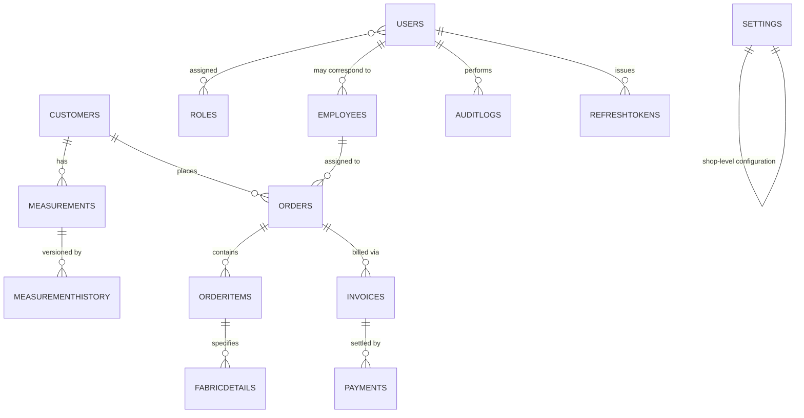

# 02 — Database

**Mathilens Tailoring ERP**
**Document Status:** Authoritative — governed by [00_MASTER_SPEC.md](./00_MASTER_SPEC.md)
**Version:** 2.1.0
**Last Updated:** 2026-08-04

> This document contains no SQL and no Entity Framework code. It defines the database design standards and the conceptual data model that any future schema, migration, or EF Core configuration must conform to.

---

## Table of Contents

1. [Database Goals](#1-database-goals)
2. [Provider Strategy](#2-provider-strategy)
3. [Migration Strategy](#3-migration-strategy)
4. [Naming Standards](#4-naming-standards)
5. [Soft Delete](#5-soft-delete)
6. [Audit Columns](#6-audit-columns)
7. [Concurrency](#7-concurrency)
8. [Transactions](#8-transactions)
9. [Entity Relationships](#9-entity-relationships)
10. [Required Entities](#10-required-entities)
11. [Backup Strategy](#11-backup-strategy)
12. [Restore Strategy](#12-restore-strategy)
13. [Performance Guidelines](#13-performance-guidelines)
14. [Future Multi-Tenant Strategy](#14-future-multi-tenant-strategy)

---

## 1. Database Goals

| # | Goal | Rationale |
|---|------|-----------|
| D1 | Correctness over convenience | Customer measurements, orders, and money are business-critical records; the schema must make invalid states hard to represent |
| D2 | Production-grade from day one | The database engine is production-capable from the first commit — no interim, lower-capability database is ever the system of record, eliminating an entire category of future migration risk |
| D3 | Disciplined, provider-independent data access | Persistence code relies only on standard EF Core LINQ/Fluent API capabilities wherever practical, avoiding unnecessary PostgreSQL-proprietary lock-in — see [2.2 Provider Independence](#22-provider-independence-practical) |
| D4 | Full auditability | Every record's origin and change history must be reconstructable — see [6. Audit Columns](#6-audit-columns) and [00_MASTER_SPEC.md § 10.6](./00_MASTER_SPEC.md#106-audit-logs) |
| D5 | Consistent conventions across every entity | A developer who has read this document can predict the shape of any table without looking it up — see [4. Naming Standards](#4-naming-standards) |
| D6 | Ready for multi-tenant SaaS growth without a redesign | See [14. Future Multi-Tenant Strategy](#14-future-multi-tenant-strategy) |

### 1.1 Guiding Principles

Every schema, migration, and data-access decision in this product is governed by this checklist:

- [ ] **PostgreSQL** is the database engine — the primary and only database for Version 1.
- [ ] **Entity Framework Core** is the only data-access technology.
- [ ] Schema is **Code First** — the EF Core entity model is the source of truth, never a hand-written DDL script.
- [ ] Schema evolves exclusively through **EF Core Migrations** (migration-based development) — see [3. Migration Strategy](#3-migration-strategy).
- [ ] All persistence access goes through the **Repository Pattern** ([01_ARCHITECTURE.md § 25.1](./01_ARCHITECTURE.md#251-repository-pattern)).
- [ ] **Clean Architecture** layering is respected — `Domain`/`Application` never depend on EF Core directly ([01_ARCHITECTURE.md § 6 Dependency Diagram](./01_ARCHITECTURE.md#6-dependency-diagram)).
- [ ] Data access is **provider-independent where practical** ([2.2 Provider Independence](#22-provider-independence-practical)).
- [ ] **No raw SQL**, unless there is no LINQ-expressible alternative — and then only isolated, documented, and reviewed.
- [ ] **Transactions** are used where appropriate ([8. Transactions](#8-transactions)).
- [ ] **Optimistic concurrency** is supported on every entity ([7. Concurrency](#7-concurrency)).
- [ ] **UUIDs** are used for primary keys where beneficial ([4.3 Primary Keys](#43-primary-keys)).
- [ ] Every business entity carries the standard **audit columns** ([6. Audit Columns](#6-audit-columns)).
- [ ] **Soft delete** is used where appropriate ([5. Soft Delete](#5-soft-delete)).
- [ ] Frequently searched/filtered columns are **indexed** ([4.5 Indexes](#45-indexes), [13.1 Index Strategy](#131-index-strategy)).
- [ ] The schema is designed for **future multi-tenant SaaS** growth without a redesign ([14. Future Multi-Tenant Strategy](#14-future-multi-tenant-strategy)).

## 2. Provider Strategy

### 2.1 PostgreSQL as the Primary Database

PostgreSQL is the primary and **only** database provider for Version 1 — this decision applies from the very first commit, with no interim or alternate provider at any phase.

- **Rationale:** PostgreSQL offers production-grade concurrent read/write support, a rich standard SQL feature set (native `uuid` type, JSON columns, full-text search, window functions), and mature tooling. Choosing it from day one removes an entire category of future risk and rework that an interim, lower-capability database would introduce later.
- **Every environment runs on PostgreSQL.** Local development, CI test runs, staging, and production all run against PostgreSQL ([2.3 Hosting Strategy](#23-hosting-strategy)) — there is no environment-specific database behavior to account for, and no "works differently locally than in production" class of bug.
- This decision directly supersedes and replaces any prior interim-database plan; PostgreSQL is the sole system of record for the life of Version 1 and beyond.

### 2.2 Provider Independence (Practical)

- All data access goes through EF Core using **provider-agnostic** patterns (LINQ, the Fluent API for model configuration) wherever practical, so the codebase does not casually accumulate PostgreSQL-proprietary dependencies it doesn't need.
- Raw SQL is avoided unless there is no LINQ-expressible alternative (e.g., a specific PostgreSQL feature with a clear, material performance or capability benefit); when used, it is isolated in `Infrastructure`, documented, and reviewed — per [00_MASTER_SPEC.md § 10.7 SQL Injection Prevention](./00_MASTER_SPEC.md#107-sql-injection-prevention), any raw SQL is always parameterized.
- This is **not** a commitment to support a second database provider — PostgreSQL is the only provider for this product. It is a discipline that keeps the codebase clean, testable, and resistant to unnecessary lock-in (e.g., to one specific PostgreSQL hosting flavor's non-standard extensions), consistent with [00_MASTER_SPEC.md § 4 Engineering Principles](./00_MASTER_SPEC.md#4-engineering-principles).

### 2.3 Hosting Strategy

PostgreSQL is deployed identically (same schema, same EF Core provider, same migration history) across four supported hosting options:

| Hosting Option | Use Case | Notes |
|-----------------|----------|-------|
| **Azure Database for PostgreSQL** (Flexible Server) | Primary production target | Managed patching, automated daily backups, point-in-time restore built in; integrates with Azure Key Vault, Azure App Service/Container Apps, and Application Insights — see [00_MASTER_SPEC.md § 13.2 Azure](./00_MASTER_SPEC.md#132-azure) |
| **Railway PostgreSQL** | Staging/preview environments, early-stage cost control | Managed Postgres add-on; same connection-string-driven configuration as production, no code differences — see [00_MASTER_SPEC.md § 13.3 Railway](./00_MASTER_SPEC.md#133-railway) |
| **Docker PostgreSQL** | Local development, CI integration test runs | Runs as a service in `docker-compose.yml`; matches the production engine exactly, eliminating "works on my machine" drift — see [00_MASTER_SPEC.md § 13.4 Docker](./00_MASTER_SPEC.md#134-docker) |
| **Self-Hosted PostgreSQL** | Fallback / on-premise or cost-sensitive deployments where a managed offering isn't available or desired | Identical schema and EF Core provider; operational burden (patching, backups, high availability) shifts to the hosting operator, so the backup/restore discipline in [11. Backup Strategy](#11-backup-strategy) and [12. Restore Strategy](#12-restore-strategy) must be executed and verified manually rather than relied upon from a managed platform |

No module or environment deviates from this list. Which option is active in a given environment is a deployment/configuration concern ([00_MASTER_SPEC.md § 13.1 Environment Variables](./00_MASTER_SPEC.md#131-environment-variables)), never a code-level branch.

## 3. Migration Strategy

- EF Core Migrations (**Code First**) is the only mechanism for schema change — the C# entity model is the source of truth, and migrations are generated from it. No manually written SQL DDL script is ever the source of truth.
- **Migration-based development:** every schema change ships as an EF Core migration committed to source control alongside the code change that requires it, and applied consistently across every environment (local Docker PostgreSQL, CI, staging, production) via the same linear migration history — no environment ever drifts from the migration log.
- Migrations are additive and reversible by default; a destructive change (column removal, type-narrowing) requires an explicit two-step process (deprecate → confirm unused → remove), documented in the change that performs it.
- No migration runs automatically against a production database without an explicit, reviewed deployment step — see [00_MASTER_SPEC.md § 13 Deployment](./00_MASTER_SPEC.md#13-deployment).
- Because PostgreSQL is the sole provider for the life of the product, the migration history is a single, continuous, linear sequence — there is no provider-transition seam to plan for or reason about.

## 4. Naming Standards

### 4.1 Table Naming

- PascalCase, plural noun: `Orders`, `Employees`, `MeasurementHistories`.
- One table per aggregate/entity documented in [10. Required Entities](#10-required-entities) — no multi-purpose "catch-all" tables.

### 4.2 Column Naming

- PascalCase: `FirstName`, `TotalAmount`, `CreatedAtUtc`.
- Date/time columns are suffixed `Utc` to make timezone handling unambiguous at the column name level.
- Boolean columns are prefixed `Is`/`Has` (`IsDeleted`, `HasPaid`).

### 4.3 Primary Keys

- Every table has a single-column primary key named `Id`.
- Primary keys are **UUIDs** (PostgreSQL's native `uuid` type), not auto-incrementing integers, used where beneficial: they can be generated client-side or server-side without a round trip, remain collision-free across future multi-tenant/data-merge scenarios ([14. Future Multi-Tenant Strategy](#14-future-multi-tenant-strategy)), and avoid leaking sequential business volume (e.g., total order count) through predictable IDs.
- Where a surrogate integer key would offer a measured, specific benefit for a purely internal, high-volume join table, that is a deliberate, documented per-entity exception — not the default.

### 4.4 Foreign Keys

- Named `<ReferencedEntity>Id` (e.g., `CustomerId`, `OrderId`).
- Every foreign key is indexed ([4.5](#45-indexes)) and enforced with a real foreign-key constraint — never an implicit, application-only relationship.

### 4.5 Indexes

- Named `IX_<Table>_<Column(s)>` (e.g., `IX_Orders_CustomerId`).
- Every foreign key column is indexed.
- Composite indexes follow the order most-selective-or-most-commonly-filtered column first, documented per entity in [10. Required Entities](#10-required-entities).
- Unique constraints are named `UQ_<Table>_<Column(s)>`.
- Full detail on index strategy, including PostgreSQL-specific techniques such as partial indexes, is in [13.1 Index Strategy](#131-index-strategy).

## 5. Soft Delete

- Entities representing business records a user can "delete" (customers, orders, employees, etc.) use **soft delete**: an `IsDeleted` flag plus `DeletedAtUtc`/`DeletedBy`, never a physical `DELETE`.
- Soft-deleted rows are excluded from normal queries via a global query filter applied consistently per entity — application code never has to remember to filter deleted rows manually.
- Physical deletion, where ever required (e.g., a compliance-driven erasure request), is a distinct, explicitly named, audited operation — never the default delete path.
- Reference/configuration data ([10.12 Settings](#1012-settings)) and immutable log data ([10.13 AuditLogs](#1013-auditlogs)) are explicitly exempt from soft delete — see their individual entity documentation for rationale.

## 6. Audit Columns

Every entity that represents a business record (all entities in [10. Required Entities](#10-required-entities) except where individually noted) carries this standard audit footprint:

| Column | Purpose |
|--------|---------|
| `CreatedAtUtc` | When the record was created |
| `CreatedBy` | Reference to the user who created it |
| `LastModifiedAtUtc` | When the record was last changed (nullable until first change) |
| `LastModifiedBy` | Reference to the user who last changed it (nullable) |
| `IsDeleted` | Soft-delete flag ([5. Soft Delete](#5-soft-delete)) |
| `DeletedAtUtc` | When the record was soft-deleted (nullable) |
| `DeletedBy` | Reference to the user who soft-deleted it (nullable) |

This standard footprint is distinct from, and complementary to, the **audit log** ([10.13 AuditLogs](#1013-auditlogs)), which records business-meaningful state transitions as discrete events rather than just "who touched this row last."

## 7. Concurrency

- Every entity carries a row-version/concurrency-token column for **optimistic concurrency control**, enforced by EF Core.
- A concurrency conflict (two users editing the same record at once) surfaces as a distinct, handled application-level error, never an unhandled exception reaching the client.
- Pessimistic locking is reserved for the rare case where optimistic concurrency is provably insufficient; it is not the default for any entity in this document.

## 8. Transactions

- One unit of work (one command handler, one HTTP request) maps to one database transaction, managed by EF Core's change-tracking `SaveChangesAsync`.
- Transactions are used wherever an operation spans more than one persisted change that must succeed or fail together (e.g., creating an `Order` and its `OrderItems` in one command) — never assumed implicitly, always a deliberate boundary drawn by the `Application` handler.
- Consistency across modules (e.g., an order being marked delivered eventually affecting billing) uses domain events and eventual consistency ([01_ARCHITECTURE.md § 21 Audit Strategy](./01_ARCHITECTURE.md#21-audit-strategy), [§ 26 Future Event-Driven Architecture](./01_ARCHITECTURE.md#26-future-event-driven-architecture)), not one sprawling cross-module transaction.

## 9. Entity Relationships

This diagram is conceptual: it shows entity relationships and cardinality only, no columns or types, and reflects the PostgreSQL-only data model described in [2.1 PostgreSQL as the Primary Database](#21-postgresql-as-the-primary-database).

## 10. Required Entities

Every entity below is documented to the same standard: Purpose, Responsibilities, Relationships, Future Expansion, Data Ownership, Validation Rules, Retention Rules, Index Recommendations, and Future Partitioning Considerations. All entities carry the standard [Audit Columns](#6-audit-columns) and [Concurrency](#7-concurrency) token unless explicitly noted otherwise, and use [UUID primary keys](#43-primary-keys) unless explicitly noted otherwise.

### 10.1 Users

| Aspect | Detail |
|--------|--------|
| **Purpose** | Represents a person who can authenticate into the system (shop owner, manager, staff member) |
| **Responsibilities** | Owns login credentials, holds the claims used for authentication/authorization ([01_ARCHITECTURE.md § 17](./01_ARCHITECTURE.md#17-authentication-flow)); is the anchor for "who did this" across every other entity's audit columns |
| **Relationships** | Assigned one or more `Roles` (many-to-many, [10.2](#102-roles)); may correspond to an `Employees` record ([10.6](#106-employees)) when the user is shop staff, not every `User` is necessarily an `Employee` and vice versa; referenced as `CreatedBy`/`LastModifiedBy`/`DeletedBy` across nearly every other entity |
| **Future Expansion** | Multi-factor authentication fields; per-tenant scoping once [14. Future Multi-Tenant Strategy](#14-future-multi-tenant-strategy) is activated |
| **Data Ownership** | Owned by the Authentication module ([00_MASTER_SPEC.md § 3](./00_MASTER_SPEC.md#3-erp-modules)); no other module writes to this entity directly |
| **Validation Rules** | Login identifier (email/username) is unique and required; password is never stored in plain or reversible form, only as a secure hash ([00_MASTER_SPEC.md § 10.4](./00_MASTER_SPEC.md#104-password-policy)) |
| **Retention Rules** | Soft-deleted on account deactivation, never physically removed while any other entity references it as `CreatedBy`/etc.; physical erasure only via an explicit, audited compliance operation |
| **Index Recommendations** | Unique index on login identifier; index on `IsDeleted` for active-user lookups (a PostgreSQL partial index on `IsDeleted = false` is a strong candidate — see [13.1 Index Strategy](#131-index-strategy)) |
| **Future Partitioning Considerations** | Once multi-tenant, partition/scope by `TenantId` alongside the shared `Users` table, or move to a per-tenant identity scheme, decided when [14. Future Multi-Tenant Strategy](#14-future-multi-tenant-strategy) is activated |

### 10.2 Roles

| Aspect | Detail |
|--------|--------|
| **Purpose** | Represents a named set of permissions a `User` can be assigned (e.g., Owner, Manager, Staff) |
| **Responsibilities** | Anchors the RBAC model ([00_MASTER_SPEC.md § 10.3](./00_MASTER_SPEC.md#103-rbac)); permission claims are associated with a role, not directly with individual users |
| **Relationships** | Many-to-many with `Users` ([10.1](#101-users)) |
| **Future Expansion** | Per-tenant custom roles once multi-tenant chains ([00_MASTER_SPEC.md § 1.4](./00_MASTER_SPEC.md#14-target-customers)) need shop-specific role definitions beyond the platform default set |
| **Data Ownership** | Owned by the Authentication module |
| **Validation Rules** | Role name is unique and required; the platform's baseline roles are seeded, not user-creatable at MVP scope |
| **Retention Rules** | Roles are not soft-deleted while any `User` holds the assignment; removal requires reassigning affected users first |
| **Index Recommendations** | Unique index on role name |
| **Future Partitioning Considerations** | If per-tenant custom roles are introduced, scope by `TenantId`; platform-baseline roles remain shared/global |

### 10.3 Customers

| Aspect | Detail |
|--------|--------|
| **Purpose** | Represents an individual who orders tailoring services from the shop |
| **Responsibilities** | Anchors a customer's contact details and links to their `Measurements` and `Orders` history |
| **Relationships** | One-to-many with `Measurements` ([10.4](#104-measurements)); one-to-many with `Orders` ([10.7](#107-orders)) |
| **Future Expansion** | Customer Portal self-service login ([00_MASTER_SPEC.md § 3, Future](./00_MASTER_SPEC.md#3-erp-modules)); loyalty/referral fields |
| **Data Ownership** | Owned by the Customer Management module |
| **Validation Rules** | At least one contact method (phone) is required — the WhatsApp module ([00_MASTER_SPEC.md § 3](./00_MASTER_SPEC.md#3-erp-modules)) depends on a valid phone number; name is required |
| **Retention Rules** | Soft-deleted on customer removal; retained indefinitely by default since historical orders/measurements reference the customer, subject to future data-retention policy |
| **Index Recommendations** | Index on phone number (primary lookup path for shop staff and for WhatsApp correlation); index on name for search |
| **Future Partitioning Considerations** | Partition/scope by `TenantId` when multi-tenant ([14. Future Multi-Tenant Strategy](#14-future-multi-tenant-strategy)); high-volume shops may warrant archival of long-inactive customer records ([13.7 Archiving Strategy](#137-archiving-strategy)) |

### 10.4 Measurements

| Aspect | Detail |
|--------|--------|
| **Purpose** | Represents the current, active set of measurements for a customer for a given garment type |
| **Responsibilities** | Holds the measurement values staff reference when creating new orders; represents "the latest known truth" for a customer's measurements |
| **Relationships** | Many-to-one with `Customers` ([10.3](#103-customers)); one-to-many with `MeasurementHistory` ([10.5](#105-measurementhistory)), which records every prior version |
| **Future Expansion** | Garment-type-specific measurement templates; AI-assisted measurement suggestions ([00_MASTER_SPEC.md § 3, Future: AI Features](./00_MASTER_SPEC.md#3-erp-modules)) |
| **Data Ownership** | Owned by the Measurement Management module |
| **Validation Rules** | Measurement values are validated against sane physical bounds (no negative or physically impossible values); garment type is required and must be a recognized type |
| **Retention Rules** | Soft-deleted only when the customer record itself is removed; a measurement update does not delete the prior `Measurements` row, it creates a `MeasurementHistory` entry ([10.5](#105-measurementhistory)) and updates this row in place |
| **Index Recommendations** | Index on `CustomerId`; composite index on `CustomerId` + garment type for fast lookup during order creation |
| **Future Partitioning Considerations** | Scope by `TenantId` when multi-tenant; no partitioning needed at Version 1 volume |

### 10.5 MeasurementHistory

| Aspect | Detail |
|--------|--------|
| **Purpose** | Represents an immutable historical snapshot of a customer's measurements at a point in time |
| **Responsibilities** | Preserves every prior version of a measurement set so staff can see how a customer's measurements changed over time, and so a past order can be tied to the exact measurement values used at the time it was placed |
| **Relationships** | Many-to-one with `Measurements` ([10.4](#104-measurements)) — each history row is a prior snapshot of one `Measurements` record |
| **Future Expansion** | Linking a specific `MeasurementHistory` snapshot directly to the `Orders`/`OrderItems` that used it, for full traceability |
| **Data Ownership** | Owned by the Measurement Management module; written automatically whenever a `Measurements` record is updated, never written directly by a user action |
| **Validation Rules** | Immutable once written — no update path exists for a `MeasurementHistory` row, only inserts |
| **Retention Rules** | Retained indefinitely by default (historical traceability is the entire purpose of this entity); not soft-deleted independently of its parent `Measurements`/`Customers` chain |
| **Index Recommendations** | Index on `MeasurementId`; index on `CreatedAtUtc` for chronological retrieval |
| **Future Partitioning Considerations** | The highest-growth entity in the schema by row count over time — a strong candidate for PostgreSQL native table partitioning (range partitioning by `CreatedAtUtc`) and archival as volume grows; see [13.6 Future Partitioning](#136-future-partitioning) and [13.7 Archiving Strategy](#137-archiving-strategy) |

### 10.6 Employees

| Aspect | Detail |
|--------|--------|
| **Purpose** | Represents a staff member of the tailoring shop |
| **Responsibilities** | Holds staff details (role in the shop, contact info) and is the entity `Orders` are assigned to for work tracking |
| **Relationships** | Optionally linked one-to-one with a `Users` record ([10.1](#101-users)) when the employee also has system login access; one-to-many with `Orders` ([10.7](#107-orders)) via assignment |
| **Future Expansion** | Payroll and attendance fields ([00_MASTER_SPEC.md § 2.2 Excluded Features](./00_MASTER_SPEC.md#22-excluded-features-explicitly-out-of-scope-for-now)) |
| **Data Ownership** | Owned by the Employee Management module |
| **Validation Rules** | Name is required; if linked to a `Users` record, the link must be unique (one employee per user account) |
| **Retention Rules** | Soft-deleted when an employee leaves the shop; historical `Orders` assignments are preserved for record-keeping |
| **Index Recommendations** | Index on `UserId` (nullable foreign key); index on `IsDeleted` for active-staff lookups |
| **Future Partitioning Considerations** | Scope by `TenantId`/shop when multi-tenant, since employees belong to exactly one shop |

### 10.7 Orders

| Aspect | Detail |
|--------|--------|
| **Purpose** | Represents a tailoring order placed by a customer — the central operational record of the business |
| **Responsibilities** | Tracks the order's lifecycle status, links the customer, assigned employee(s), garment items, and drives billing and WhatsApp notifications |
| **Relationships** | Many-to-one with `Customers` ([10.3](#103-customers)); many-to-one (or many-to-many, if multiple staff can be assigned) with `Employees` ([10.6](#106-employees)); one-to-many with `OrderItems` ([10.8](#108-orderitems)); one-to-many with `Invoices` ([10.9](#109-invoices)) |
| **Future Expansion** | Multi-branch order routing; e-commerce-originated orders ([00_MASTER_SPEC.md § 3, Future](./00_MASTER_SPEC.md#3-erp-modules)) |
| **Data Ownership** | Owned by the Tailoring Orders module |
| **Validation Rules** | Must reference a valid, non-deleted `Customer`; status transitions follow a defined, enforced lifecycle (e.g., cannot move to "Delivered" without passing through "In Progress") — enforced in `Domain`, not just at the database level, per [01_ARCHITECTURE.md § 9.3](./01_ARCHITECTURE.md#93-domain-layer) |
| **Retention Rules** | Soft-deleted only in exceptional cases (e.g., an order created in error); completed/delivered orders are retained indefinitely as business history and billing records |
| **Index Recommendations** | Index on `CustomerId`; index on assigned `EmployeeId`; composite index on status + due/delivery date for operational dashboards and reports |
| **Future Partitioning Considerations** | Candidate for PostgreSQL native date-based partitioning at high order volume; scope by `TenantId` when multi-tenant — see [13.6 Future Partitioning](#136-future-partitioning) |

### 10.8 OrderItems

| Aspect | Detail |
|--------|--------|
| **Purpose** | Represents a single garment/line item within an `Order` |
| **Responsibilities** | Captures the specific garment type, quantity, and pricing for one line of an order; links to the `FabricDetails` used for that item |
| **Relationships** | Many-to-one with `Orders` ([10.7](#107-orders)); one-to-many (or one-to-one, depending on granularity chosen during implementation) with `FabricDetails` ([10.11](#1011-fabricdetails)) |
| **Future Expansion** | Linking directly to the specific `MeasurementHistory` snapshot used ([10.5](#105-measurementhistory) Future Expansion) |
| **Data Ownership** | Owned by the Tailoring Orders module |
| **Validation Rules** | Must reference a valid parent `Order`; quantity and unit price must be positive; garment type is required |
| **Retention Rules** | Follows the retention of its parent `Order` — never independently deleted while the parent order exists |
| **Index Recommendations** | Index on `OrderId` |
| **Future Partitioning Considerations** | Follows the partitioning strategy of its parent `Orders` table |

### 10.9 Invoices

| Aspect | Detail |
|--------|--------|
| **Purpose** | Represents a bill issued to a customer for one or more orders |
| **Responsibilities** | Captures the billed amount, tax/discount breakdown, and billing status; is the record `Payments` settle against |
| **Relationships** | Many-to-one with `Orders` ([10.7](#107-orders)) (or many-to-many if one invoice can span multiple orders — decided during Billing module design); one-to-many with `Payments` ([10.10](#1010-payments)) |
| **Future Expansion** | Multi-currency support ([00_MASTER_SPEC.md § 1.5 Target Market](./00_MASTER_SPEC.md#15-target-market)); integration with external accounting systems |
| **Data Ownership** | Owned by the Billing module |
| **Validation Rules** | Total amount must reconcile with its line items/associated order value; an invoice cannot be modified once fully paid — corrections go through a documented adjustment/credit process, not an in-place edit of a settled invoice |
| **Retention Rules** | Never soft-deleted in the ordinary course of business — invoices are financial records retained indefinitely (or per applicable regulatory retention period, to be confirmed in [08_SECURITY.md](./08_SECURITY.md)) |
| **Index Recommendations** | Index on `OrderId`/`CustomerId`; index on billing status + date for financial reporting |
| **Future Partitioning Considerations** | Strong candidate for PostgreSQL native date-based partitioning/archival at scale, consistent with typical financial-record retention needs — see [13.6](#136-future-partitioning)/[13.7](#137-archiving-strategy) |

### 10.10 Payments

| Aspect | Detail |
|--------|--------|
| **Purpose** | Represents a single payment transaction made against an `Invoice` |
| **Responsibilities** | Tracks amount paid, payment method, and timestamp, supporting partial and multiple payments against one invoice |
| **Relationships** | Many-to-one with `Invoices` ([10.9](#109-invoices)) |
| **Future Expansion** | Payment gateway integration; refund tracking as a distinct transaction type |
| **Data Ownership** | Owned by the Billing module |
| **Validation Rules** | Amount must be positive and must not cause the sum of payments on an invoice to exceed the invoice total; must reference a valid, non-deleted invoice |
| **Retention Rules** | Never soft-deleted or edited after creation — a correction is recorded as a new, offsetting transaction, never a mutation of a historical payment record, to preserve financial audit integrity |
| **Index Recommendations** | Index on `InvoiceId`; index on payment date for reconciliation and reporting |
| **Future Partitioning Considerations** | Same date-based partitioning candidacy as `Invoices` |

### 10.11 FabricDetails

| Aspect | Detail |
|--------|--------|
| **Purpose** | Represents the fabric/material details associated with an order item — type, source, color, quantity used |
| **Responsibilities** | Captures what fabric was used for a specific garment, whether customer-supplied or shop-supplied |
| **Relationships** | Many-to-one (or one-to-one) with `OrderItems` ([10.8](#108-orderitems)) |
| **Future Expansion** | Full linkage to an `Inventory` module ([00_MASTER_SPEC.md § 3, Future](./00_MASTER_SPEC.md#3-erp-modules)) for stock-level tracking, once that module is scoped — `FabricDetails` today records what was used, not what is in stock |
| **Data Ownership** | Owned by the Fabric Details module (currently scoped as a sub-concern of Tailoring Orders per [00_MASTER_SPEC.md § 3](./00_MASTER_SPEC.md#3-erp-modules)) |
| **Validation Rules** | Quantity must be positive; source (customer-supplied vs. shop-supplied) is required, since it affects billing |
| **Retention Rules** | Follows the retention of its parent `OrderItem`/`Order` |
| **Index Recommendations** | Index on `OrderItemId` |
| **Future Partitioning Considerations** | Follows the partitioning strategy of `Orders`/`OrderItems`; will need reevaluation once linked to a future `Inventory` module |

### 10.12 Settings

| Aspect | Detail |
|--------|--------|
| **Purpose** | Represents shop-level configuration: business profile, preferences, and integration settings |
| **Responsibilities** | Single source of configurable, shop-specific values (e.g., business name, address, tax settings, WhatsApp integration configuration) referenced across modules |
| **Relationships** | Conceptually independent of other entities; referenced by nearly every module for configuration values rather than holding foreign keys itself |
| **Future Expansion** | Per-branch settings once multi-branch is supported ([00_MASTER_SPEC.md § 1.7](./00_MASTER_SPEC.md#19-future-vision)); per-tenant settings once multi-tenant ([14. Future Multi-Tenant Strategy](#14-future-multi-tenant-strategy)) |
| **Data Ownership** | Owned by the Settings module; written only through explicit administrative action, never inferred |
| **Validation Rules** | Setting keys are unique; values are validated against the expected type/format for that specific setting |
| **Retention Rules** | Not soft-deleted using the standard pattern — configuration is either present with a current value or reset to a documented default; historical setting values are not retained unless a specific audit need is identified |
| **Index Recommendations** | Unique index on setting key |
| **Future Partitioning Considerations** | Scope by `TenantId` (and possibly branch) when multi-tenant/multi-branch is introduced |

### 10.13 AuditLogs

| Aspect | Detail |
|--------|--------|
| **Purpose** | Represents an immutable record of a business-meaningful state change anywhere in the system, per [00_MASTER_SPEC.md § 10.6](./00_MASTER_SPEC.md#106-audit-logs) and [01_ARCHITECTURE.md § 21 Audit Strategy](./01_ARCHITECTURE.md#21-audit-strategy) |
| **Responsibilities** | Captures what changed, the before/after values relevant to that change, who performed it, and when — independent of, and in addition to, the standard [Audit Columns](#6-audit-columns) present on individual entities |
| **Relationships** | References the `User` who performed the action ([10.1](#101-users)); references the affected entity generically (entity type + entity ID) rather than via a dedicated foreign key per entity type, since it must be able to log against any entity in the system |
| **Future Expansion** | Structured, queryable diff storage for complex entities; retention-tiering (hot vs. archived audit data) at scale |
| **Data Ownership** | Written exclusively by the cross-cutting audit mechanism described in [01_ARCHITECTURE.md § 21](./01_ARCHITECTURE.md#21-audit-strategy) — no module writes to `AuditLogs` directly as part of its own business logic |
| **Validation Rules** | Immutable once written — insert-only, no update or delete path, including no soft delete (see Retention Rules) |
| **Retention Rules** | Explicitly **exempt from soft delete** ([5. Soft Delete](#5-soft-delete)) — an audit log entry must never be hideable or removable through the normal application delete path, since that would defeat its purpose; retained per the retention period defined in [08_SECURITY.md](./08_SECURITY.md) |
| **Index Recommendations** | Index on affected entity type + entity ID (primary lookup path: "show me the history of this record"); index on `UserId`; index on `CreatedAtUtc` for chronological/compliance queries |
| **Future Partitioning Considerations** | The second-highest-growth entity by row count after `MeasurementHistory` — a strong candidate for PostgreSQL native partitioning and cold-storage archival as volume grows; see [13.6 Future Partitioning](#136-future-partitioning) and [13.7 Archiving Strategy](#137-archiving-strategy) |

### 10.14 RefreshTokens

> Added during Phase 1 implementation: the refresh-token rotation behavior in [00_MASTER_SPEC.md § 10.1](./00_MASTER_SPEC.md#101-authentication) and [01_ARCHITECTURE.md § 17 Authentication Flow](./01_ARCHITECTURE.md#17-authentication-flow) requires persistent storage that the original 13-entity list did not enumerate. Documented here to keep this file authoritative, per [00_MASTER_SPEC.md § 14](./00_MASTER_SPEC.md#14-documentation).

| Aspect | Detail |
|--------|--------|
| **Purpose** | Represents a single issued refresh token in a rotation chain, supporting the single-use, rotate-on-refresh JWT flow |
| **Responsibilities** | Tracks the token's hash, expiry, and revocation state; enables replay detection (a revoked token presented again signals token theft) |
| **Relationships** | Many-to-one with `Users` ([10.1](#101-users)) via `UserId`; self-referencing via `ReplacedByTokenId` to trace the rotation chain |
| **Future Expansion** | Device/client metadata (for a "manage active sessions" UI); geographic/IP anomaly detection |
| **Data Ownership** | Owned by the Authentication module; written only by the authentication flow itself, never directly by other modules |
| **Validation Rules** | `TokenHash` is required and unique — only the hash is ever persisted, never the raw token; `ExpiresAtUtc` must be after the token's issued time |
| **Retention Rules** | Not soft-deleted ([5. Soft Delete](#5-soft-delete) does not apply — a refresh token's lifecycle is active → rotated/revoked or expired, not the soft-delete lifecycle of a business record); expired/revoked tokens are retained for a security-audit window, then eligible for archival/purge per [13.7 Archiving Strategy](#137-archiving-strategy) |
| **Index Recommendations** | Unique index on `TokenHash` (the primary lookup path on every refresh request); index on `UserId` (to revoke all of a user's active tokens on replay detection) |
| **Future Partitioning Considerations** | High-growth, short-lived-relevance data — a candidate for aggressive archival/purge of expired rows well before `MeasurementHistory` or `AuditLogs` need it |

---

## 11. Backup Strategy

### 11.1 Daily Backup

- Automated, scheduled full backups of the production PostgreSQL database are taken **daily at minimum**, at a defined low-traffic time window (exact schedule fixed in [07_DEPLOYMENT.md](./07_DEPLOYMENT.md)).
- On managed hosting (**Azure Database for PostgreSQL**, **Railway PostgreSQL**), daily backups are provided by the platform's managed backup feature and are explicitly enabled and verified as part of environment provisioning — never left at an unverified default.
- On **self-hosted PostgreSQL** ([2.3 Hosting Strategy](#23-hosting-strategy)), daily backups are performed via a scheduled, automated database dump run on an automated schedule, stored to durable, separate storage — this document specifies the requirement, not the implementation script.
- Backups are stored separately from the primary database's infrastructure in every case, so a failure of the primary environment cannot also destroy its backups.

### 11.2 Point-in-Time Recovery (PITR)

- Beyond daily full backups, continuous write-ahead log (WAL) archiving is enabled so the database can be restored to any point in time within the retention window — not just to the moment of the last daily backup.
- On managed hosting, PITR is enabled via the platform's native point-in-time restore feature (both Azure Database for PostgreSQL and Railway PostgreSQL support this).
- On self-hosted PostgreSQL, PITR requires WAL archiving to be explicitly configured and monitored as part of that hosting option's operational responsibility.
- The PITR retention window is defined in [07_DEPLOYMENT.md](./07_DEPLOYMENT.md) to satisfy the product's Recovery Point Objective (RPO) — see [12.2 Disaster Recovery](#122-disaster-recovery).

## 12. Restore Strategy

### 12.1 Restore Process

- A documented, tested restore procedure exists for every hosting option in active use before production launch — an untested backup is treated as equivalent to no backup, per [00_MASTER_SPEC.md § 13.7 Recovery](./00_MASTER_SPEC.md#137-recovery).
- Restore drills are performed periodically (frequency fixed in [07_DEPLOYMENT.md](./07_DEPLOYMENT.md)) against a non-production environment to verify both the daily-backup and PITR paths are actually restorable, not merely present.
- The restore mechanics are the same PostgreSQL-native process regardless of hosting option ([2.3 Hosting Strategy](#23-hosting-strategy)); only the operational trigger differs — a managed-hosting restore is initiated through the platform's console/API, a self-hosted restore is executed directly against the server by the hosting operator.

### 12.2 Disaster Recovery

- A Recovery Time Objective (RTO) and Recovery Point Objective (RPO) are defined in [07_DEPLOYMENT.md](./07_DEPLOYMENT.md) before production launch, and both the backup strategy ([11. Backup Strategy](#11-backup-strategy)) and restore process ([12.1](#121-restore-process)) are validated against them.
- Disaster recovery covers total loss of the primary hosting environment, not just data corruption — the restore target is a newly provisioned PostgreSQL instance (potentially in a different region or on a different host), never assumed to be the same physical instance that failed.
- For managed hosting, cross-region backup replication is evaluated as part of the DR plan where the platform supports it. For self-hosted PostgreSQL, DR requires an explicit, separate backup storage location outside the primary hosting environment's blast radius, since no platform-level cross-region replication is provided automatically.

## 13. Performance Guidelines

### 13.1 Index Strategy

- Every foreign key column is indexed ([4.5 Indexes](#45-indexes)); each entity's per-entity Index Recommendations in [10. Required Entities](#10-required-entities) define its baseline indexes.
- Indexes are added deliberately, driven by real, identified query patterns — never speculatively on every column.
- PostgreSQL **partial indexes** are used where beneficial (e.g., an index on `IsDeleted = false` rows only, for the common "active records" query shape) — a standard PostgreSQL optimization made directly available by PostgreSQL being the sole provider.

### 13.2 Query Optimization

- No N+1 query patterns — every repository method fetches what it needs in one round trip via explicit projection/`Include`, checked in code review ([00_MASTER_SPEC.md § 11.3](./00_MASTER_SPEC.md#113-query-optimization)).
- Lazy loading is disabled solution-wide; related data is always fetched explicitly so its cost is visible at the call site.
- Read-only queries project directly to DTOs rather than materializing full entity graphs, consistent with the CQRS query pattern ([01_ARCHITECTURE.md § 25.2 CQRS](./01_ARCHITECTURE.md#252-cqrs)).

### 13.3 Pagination

- Every collection-returning query is paginated by default, per [00_MASTER_SPEC.md § 8.3 Pagination](./00_MASTER_SPEC.md#83-pagination) — no endpoint or report query fetches an unbounded result set.
- Pagination is implemented with standard `LIMIT`/`OFFSET` for typical page depths, with keyset (seek) pagination adopted for specific high-page-depth result sets where offset pagination's performance degrades — the technique is chosen per query pattern, not fixed globally.

### 13.4 Connection Pooling

- The API connects to PostgreSQL through a connection pool, sized deliberately per deployment (never left at a framework default without review) — unbounded or misconfigured pooling is a leading cause of production database incidents at scale.
- Connection pool utilization and exhaustion are monitored as first-class operational metrics ([00_MASTER_SPEC.md § 11.5 Logging](./00_MASTER_SPEC.md#115-logging) / APM per [00_MASTER_SPEC.md § 5 Technology Stack](./00_MASTER_SPEC.md#5-technology-stack)).
- As the platform scales horizontally (multiple API instances, [01_ARCHITECTURE.md § 22 Scalability Strategy](./01_ARCHITECTURE.md#22-scalability-strategy)), a dedicated connection pooler (e.g., PgBouncer, or a managed hosting platform's built-in pooler) is introduced ahead of connection-count pressure, not reactively after an incident.

### 13.5 Read Scalability

- PostgreSQL's native support for concurrent readers means read-heavy endpoints scale on the primary instance well beyond Version 1 load without any architectural change.
- **Read replicas** are the designated future lever for read scalability once a single instance's read capacity is genuinely the bottleneck (not before). Reporting and dashboard queries ([00_MASTER_SPEC.md § 3 ERP Modules](./00_MASTER_SPEC.md#3-erp-modules): Reports, Dashboard) are the natural first candidates to route to a replica, since they are read-only by construction (CQRS queries, [01_ARCHITECTURE.md § 25.2](./01_ARCHITECTURE.md#252-cqrs)).
- Introducing a read replica is an `Infrastructure`-layer routing change (directing specific queries to a replica connection string), not a `Domain`/`Application` change, consistent with the layering discipline in [01_ARCHITECTURE.md § 6 Dependency Diagram](./01_ARCHITECTURE.md#6-dependency-diagram).

### 13.6 Future Partitioning

- High-growth entities are explicitly flagged in [10. Required Entities](#10-required-entities): `MeasurementHistory`, `Orders`, `Invoices`, `Payments`, and `AuditLogs`.
- PostgreSQL native declarative table partitioning (e.g., range partitioning by `CreatedAtUtc`) is the designated mechanism when a table's size genuinely degrades query performance — introduced proactively once growth trends are visible in production monitoring, not only after a performance incident.
- Partitioning is an `Infrastructure`-layer/schema concern; it does not change how `Application`/`Domain` query the entity through its repository ([01_ARCHITECTURE.md § 25.1 Repository Pattern](./01_ARCHITECTURE.md#251-repository-pattern)).

### 13.7 Archiving Strategy

- Entities with a defined retention purpose but declining query relevance over time (notably `AuditLogs` and `MeasurementHistory`) are candidates for tiered archival — moving old partitions to cheaper, slower storage — once their live-table size affects performance, rather than retaining every row in the primary hot storage tier indefinitely.
- Archiving is additive: archived data remains queryable (e.g., via a separate reporting path) but is not part of the primary transactional working set.
- No archiving mechanism is built before a real volume trigger exists ([00_MASTER_SPEC.md § 4.5 YAGNI](./00_MASTER_SPEC.md#45-yagni)) — this section documents the intended lever, not a Version 1 deliverable.

## 14. Future Multi-Tenant Strategy

This section is the database-level companion to [01_ARCHITECTURE.md § 24 Future Multi-Tenant Strategy](./01_ARCHITECTURE.md#24-future-multi-tenant-strategy).

- **Not part of the Version 1 schema.** None of the 14 entities documented in [10. Required Entities](#10-required-entities) carry a `TenantId` column today — Version 1's deployment model is one database per shop deployment (or a small number of pilot shops sharing one deployment), not a shared multi-tenant database.
- **Planned isolation model:** when multi-tenant SaaS operation begins — triggered by real commercial demand for a shared platform, **not** by any database-engine constraint, since PostgreSQL already supports the target isolation model natively — a `Tenants` entity is introduced, and every entity in [10. Required Entities](#10-required-entities) gains a `TenantId` foreign key, enforced via an EF Core global query filter so no query can ever cross tenants, mirroring [01_ARCHITECTURE.md § 24](./01_ARCHITECTURE.md#24-future-multi-tenant-strategy).
- **Why this is deferred, not designed now:** adding `TenantId` to every entity before there is a second tenant sharing infrastructure would be speculative schema complexity with no current user, which [00_MASTER_SPEC.md § 4.5 YAGNI](./00_MASTER_SPEC.md#45-yagni) explicitly rules out.
- **Why this remains low-risk to defer:** every entity's persistence access already goes through the Repository Pattern ([01_ARCHITECTURE.md § 25.1](./01_ARCHITECTURE.md#251-repository-pattern)), so introducing tenant-scoped filtering later is a contained, centralized `Infrastructure`-layer change. Because PostgreSQL is already the Version 1 database, activating multi-tenancy requires **zero database-engine migration** — it is purely a schema/tenancy-model change on the same database the product has run on since day one, which is strictly simpler than the combined provider-migration-plus-tenancy-activation this document previously anticipated.

---

## Related Documents

- [00_MASTER_SPEC.md](./00_MASTER_SPEC.md)
- [01_ARCHITECTURE.md](./01_ARCHITECTURE.md)
- [08_SECURITY.md](./08_SECURITY.md)
- [07_DEPLOYMENT.md](./07_DEPLOYMENT.md)
